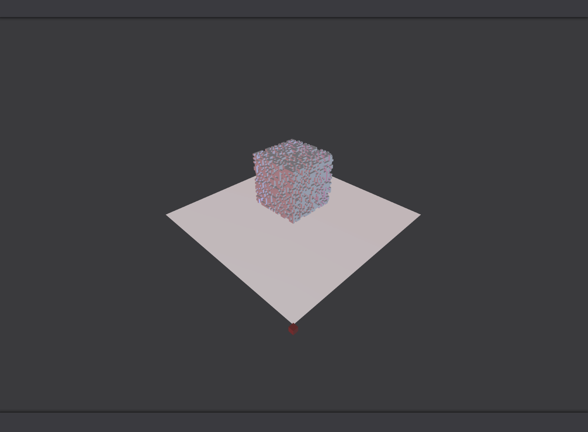

# np2vox
A simple Python class to visualize binary Numpy arrays in the browser with Three.js.

Supports rendering a single numpy array or a list of arrays as an animation.

The browser interaction is serverless, just uses Python's webbrowser module to open a generated html page.

## Dependencies
* [Jinja2](https://github.com/pallets/jinja) - used for templating
* Python3+

## Credits
* [Three.js](https://github.com/mrdoob/three.js/) - 3D rendering in the browser
